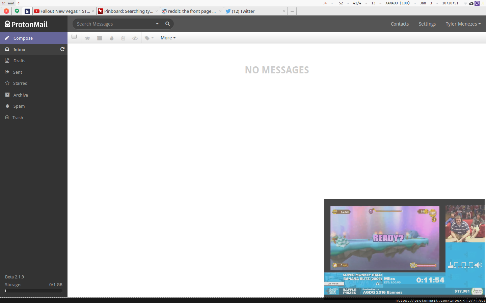

I'm a huge fan of [speedrunning](https://en.wikipedia.org/wiki/Speedrun) (I was actually close to a
few world-records for Mirror's Edge back in 2010) so I'm always really excited when
[AGDQ](https://gamesdonequick.com/) -- a huge, semi-yearly speedrunning marathon for charity --
rolls around.

Unfortunately, AGDQ is hosted on the first week of the new year, which is the first week many
people are back from break, so a busy week of meetings for me. In order to be able to keep an eye
on what's going on during the week, I wanted a way to overlay the stream on my desktop.

## Setting Up a Picture-in-Picture Window

Luckily, i3 added support for marking a window "sticky" in 4.0.1, meaning we can create a quick
`keysym` for our i3 conf file to get most of the effect we're after: [^1]

    bindsym $mod+c exec "i3-msg 'floating toggle; sticky toggle; resize shrink width 10000px; resize grow width 400px; resize shrink height 10000px; resize grow height 250px;move position 10px 10px;'"

## Getting a Twitch Window

This is the easiest step! [Livestreamer](http://docs.livestreamer.io/) is a wonderful app which
can load streams from livestreaming websites, and pass them onto a media player -- we'll use
[mpv](https://mpv.io/) for its minimal interface.

I'm also using [livestreamer-twitch-gui](https://github.com/bastimeyer/livestreamer-twitch-gui) to
find the stream and send it over to Livestreamer. This is optional, but it's nice enough that I
haven't found the need to load up the Twitch website in several weeks.

There's no special configuration needed for any of these three packages, just install them as
usual.

## Making the Window Transparent

It's already looking pretty good, but to avoid blocking the entire screen, I also wanted to make
the window partially transparent. Transparency is only possible by installing a compositing manager
alongside i3. I'm using [Compton](https://github.com/chjj/compton), which provides a
somewhat-obscure configuration language for specifying opacity rules per-window.

We'll ask Compton to make all stickied mpv windows 25% transparent (75% opaque) by adding the
following to `compton.conf`:

    opacity-rule = [
        "100:_NET_WM_STATE@:a !*?= '_NET_WM_STATE_STICKY' && class_g='mpv'",
        "70:_NET_WM_STATE@:a *?= '_NET_WM_STATE_STICKY' && class_g='mpv'"
    ];

(Note that we also need to reset the transparency back to 100 for non-stickied windows.)

With a quick restart of Compton, we're done!

[^1]: i3 doesn't support setting the size of a window, only growing and shrinking it. Since we don't know the inital size, the provided snippet first makes it 0x0, then grows it to the desired size.
