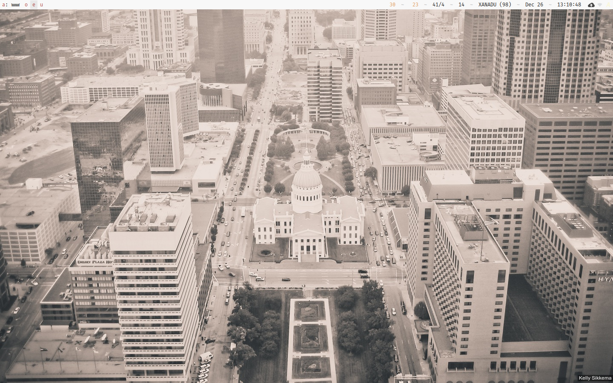

I often find myself really excited about a new desktop background, only to get tired of it within a
few days at most. As a fun solution to this problem, I recently created a script which changes my
background a random featured photo from the many beautiful photos on
[Unsplash](https://unsplash.com).

Here's a sample of the end result:

In order to use this script, you'll need to
[register for API access](https://unsplash.com/oauth/applications/new), and set `CLIENT_ID` to the
"Application ID" you'll get after it's created. (Unsplash requires that you set a Callback URL in
order to register, but we won't need it, so feel free to set it to anything you'd like.)

Here's the script:

    #!/usr/bin/bash

    # Configuration:
    CLIENT_ID=YOUR_APPLICATION_ID_FROM_UNSPLASH_HERE
    OUT=~/Pictures/Backgrounds/unsplash.jpg

    # Auto-detected Configuration and constants:
    if hash system_profiler 2>/dev/null; then   # Mac
        WIDTH=$(system_profiler SPDisplaysDataType | grep Resolution | awk '{print $2}')
        HEIGHT=$(system_profiler SPDisplaysDataType | grep Resolution | awk '{print $4}')
    else    # Linux
        WIDTH=$(xrandr --current | grep '*' | uniq | awk '{print $1}' | cut -d 'x' -f1)
        HEIGHT=$(xrandr --current | grep '*' | uniq | awk '{print $1}' | cut -d 'x' -f2)
    fi
    URL="https://api.unsplash.com/photos/random?featured=1&w=$WIDTH&h=$HEIGHT&client_id=$CLIENT_ID"
    TMP=/tmp/unsplash

    # Request a random photo, and parse out some details from the resulting JSON using Perl (sort of a
    # hack, but avoids adding dependencies.)
    JSON=$(curl -vs $URL 2>/dev/null)
    IMG=$(echo $JSON | perl -pe 's|.*"custom":"(.*?)".*|\1|')
    NAME=$(echo $JSON | perl -pe 's|.*"name":"(.*?)".*|\1|')

    # Download and, if successful, process the resulting photo
    wget "$IMG" -O "$TMP" >/dev/null 2>&1
    if [ $? -eq 0 ]; then
        if hash convert 2>/dev/null; then
            convert $TMP  -fill white  -undercolor '#00000080'  -gravity SouthEast -annotate +0+5 \
                    " $NAME " $OUT
        else
            mv $TMP $OUT
        fi
    fi

    # Update the final background
    if hash convert 2>/dev/null; then   # Linux
        hsetroot -fill $OUT
    elif hash osascript 2>/dev/null; then    # Mac
        osascript -e "tell application 'Finder' to set desktop picture to POSIX file '$OUT'"
    fi

Each time you call this script, it will pick a new random image and update the desktop
background.[^1] You can manually call it whenever you're feeling like a new background, or
automatically call it in a cronjob.[^2]

[^1]: On Linux, this requires `hsetroot`. I haven't actually tested it on Mac, so let me know if it works!
[^2]: Remember that, if you're using Linux, you will need to add `XAUTHORITY=~/.Xauthority DISPLAY=:0` to the beginning of the command in the cronjob in order for it to work correctly.
